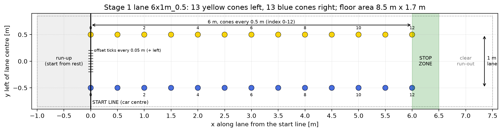
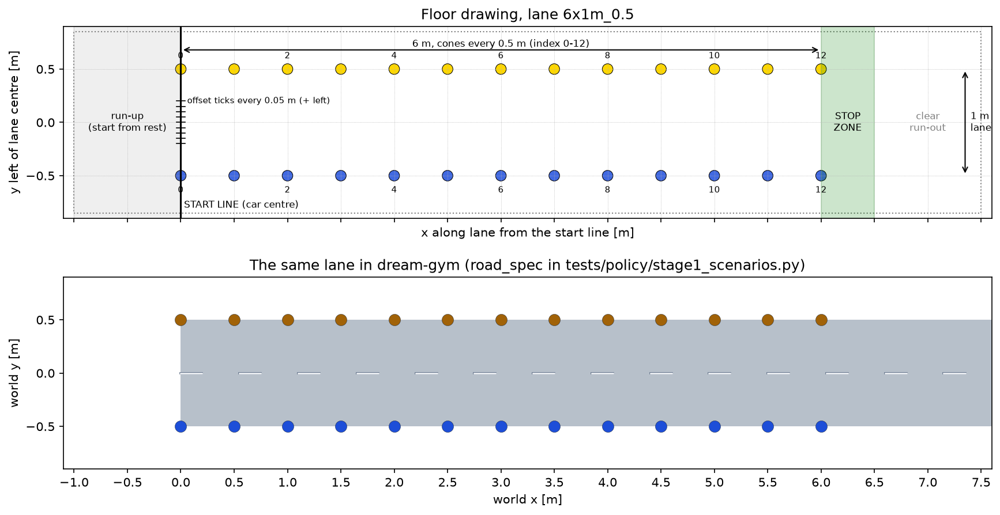

# Stage 1 test cases: straight lanes with even cones

Output of **Card 2** in [movement-policy-tasks.md](movement-policy-tasks.md) (tasks 2.1 to 2.5): dream-gym roads
of different sizes to test with, and the code structure that runs the test cases on them. The same lanes, cones and
starts are used in simulation and on the floor.

| What | Where |
| --- | --- |
| Lanes, disturbances, metrics, pass rule and simulation runner | `tests/policy/stage1_scenarios.py` |
| Tuning cases (use these for design) | `tests/policy/stage1_tuning_cases.py` |
| Unseen cases (final comparison only) | `tests/policy/unseen/stage1_unseen_cases.py` |
| pytest checks of the harness and the MPC on every tuning case | `tests/policy/test_stage1_scenarios.py` |
| Road construction notebook for the lanes | `tests/policy/stage1_road_construction.ipynb` |
| Printable floor drawings, drawings beside the simulated lanes, trajectories | `docs/figures/` |
| Test record sheet template | [stage1-test-record-sheet.csv](stage1-test-record-sheet.csv) |

```bash
pip install -r requirements.txt && pip install wheels/*.whl
python3 -m pytest tests/policy/                           # CI: harness checks and tuning cases
python3 tests/policy/stage1_scenarios.py --figures out/   # metrics table and trajectories for the log-book
python3 tests/policy/stage1_scenarios.py --layout docs/figures   # redraw the floor drawings
```

**Testing a design.** `run_case(case, policy)` accepts any object with `run_policy(observations, lanes)` returning
a `DriveCommand`, so MPC and RL use the same cases, metrics and disturbances (Card 1.3). The policy only receives
cone detections, wheel speed and timing; the simulator's ground truth is used only to set up the case, create the
disturbances and score the run.

**Adding a case or a road size.** Add a `Stage1Case` to `stage1_tuning_cases.py`, with a `Lane(length_m, width_m,
cone_spacing_m)` for a new road size. The harness builds the dream-gym road, and pytest checks it against the
drawing and runs the MPC on it.

## 2.1 Test case table

Signs: left of the lane centre and pointing left are positive. The car starts with its centre on the start line,
already at the case speed (a rolling start). Lane sizes are length x width, then cone spacing.

| Case | Set | Lane | Start | Speed | Disturbance |
| --- | --- | --- | --- | --- | --- |
| T1 | Tuning | 6 x 1.0 m, 0.5 m | Centred, straight | 1.0 m/s | None |
| T2 | Tuning | 6 x 1.0 m, 0.5 m | 0.15 m to the left | 1.0 m/s | None |
| T3 | Tuning | 6 x 1.0 m, 0.5 m | 10 degrees off to the left | 1.0 m/s | None |
| T4 | Tuning | 6 x 1.0 m, 0.5 m | Centred, straight | 1.0 m/s | Detector noise 0.03 m and one missed cone (yellow 6) |
| T5 | Tuning | 6 x 1.0 m, 0.5 m | 0.15 m right, 10 degrees off to the right | 1.0 m/s | None |
| T6 | Tuning | 6 x 1.0 m, 0.5 m | Centred, straight | 1.0 m/s | 0.2 s detection delay |
| T7 | Tuning | 6 x **0.8 m**, 0.5 m | 0.1 m to the left | 1.0 m/s | None |
| T8 | Tuning | 6 x **1.2 m**, **0.75 m** | 0.15 m to the right | 1.0 m/s | None |
| T9 | Tuning | **8** x 1.0 m, 0.5 m | 5 degrees off to the left | 1.0 m/s | None |
| T10 | Tuning | 6 x 1.0 m, 0.5 m | Centred, straight | 1.0 m/s | Extra object beside the lane; glare limits the camera to 3 m |
| T11 | Tuning | 6 x 1.0 m, 0.5 m | 0.1 m to the left | 1.0 m/s | Wet floor (dynamic car model), car 20% heavier |
| U1-U3 | Unseen | Kept in `tests/policy/unseen/` | | | |

T1-T4 are the card's starting cases. T5 checks right turns as well as left, and T6 isolates delay. T7-T9 are the
roads of different sizes, and T10-T11 cover the other Card 2.4 disturbances. The **unseen cases** combine starts,
speeds, lane sizes and disturbances not used for tuning. Do not open or run them while tuning MPC or RL; pytest
skips them unless run with `--run-unseen`, which is only for milestone M1.

### Pass thresholds

**Provisional** until the Card 1.1 requirement and metric table is agreed; `Thresholds` in
`stage1_scenarios.py` holds the values, and both must be kept the same. Every case uses the same thresholds, and
passes only if every row holds.

| Requirement | Metric | Pass if |
| --- | --- | --- |
| R1 Stay in lane | How far any body corner goes past a cone row while beside the cones | 0.0 m |
| R1 Stay in lane | Distance from the lane centre at the last cone pair, or where the car stopped before it | at most 0.10 m |
| R2 No cone touched | Cones within 0.05 m (a cone base radius) of the car body | 0 |
| R3 Hold speed | Mean absolute speed error from 1 m after the start to 1 m before the end, until the first stop request | at most 0.10 m/s |
| R4 Smooth | RMS rate of change of the requested curvature | at most 1.0 1/(m s) |
| R5 Stop at lane end | Car centre's stop position past the last cone pair | 0.0 to 0.5 m |
| R6 Real time | Solver fallback count | 0 |
| R6 Real time | 99th-percentile calculation time per policy step | at most 50 ms (only meaningful on the car computer) |

The curvature-rate limit is about a fifth of the simulated steering servo's rate limit (90 degrees per second
at the 0.33 m wheelbase). The stop zone follows the card's example rule.

### Current result: shipped MPC on the tuning cases

Shipped `MpcConfig` defaults with the case's speed and lane width, in simulation (5 October 2026):

| Case | Lane | Touched | Outside lane [m] | Lat. err. at end [m] | Speed err. [m/s] | Curv. rate RMS [1/(m s)] | Stop past last cone [m] | Fallbacks | Result |
| --- | --- | --- | --- | --- | --- | --- | --- | --- | --- |
| T1 | 6x1m_0.5 | 0 | 0.000 | 0.002 | 0.000 | 0.14 | -0.50 | 0 | Fail (R5) |
| T2 | 6x1m_0.5 | 0 | 0.000 | 0.003 | 0.000 | 0.35 | -0.51 | 0 | Fail (R5) |
| T3 | 6x1m_0.5 | 0 | 0.000 | 0.001 | 0.000 | 0.32 | -0.50 | 0 | Fail (R5) |
| T4 | 6x1m_0.5 | 0 | 0.000 | 0.002 | 0.000 | 0.35 | -0.50 | 0 | Fail (R5) |
| T5 | 6x1m_0.5 | 0 | 0.000 | 0.000 | 0.000 | 0.62 | -0.51 | 0 | Fail (R5) |
| T6 | 6x1m_0.5 | 0 | 0.000 | 0.005 | 0.003 | 0.12 | -0.38 | 0 | Fail (R5) |
| T7 | 6x0.8m_0.5 | 0 | 0.000 | 0.000 | 0.000 | 0.25 | -0.40 | 0 | Fail (R5) |
| T8 | 6x1.2m_0.75 | 0 | 0.000 | 0.000 | 0.000 | 0.38 | -0.91 | 0 | Fail (R5) |
| T9 | 8x1m_0.5 | 0 | 0.000 | 0.000 | 0.000 | 0.17 | -0.50 | 0 | Fail (R5) |
| T10 | 6x1m_0.5 | 0 | 0.000 | 0.006 | 0.000 | 0.37 | -0.50 | 0 | Fail (R5) |
| T11 | 6x1m_0.5 | 0 | 0.000 | 0.122 | 0.001 | 0.86 | -0.21 | 0 | Fail (R1, R5) |

- **Lane end (R5, all cases).** The MPC follows the lane well but stops 0.4 to 0.9 m **before** the last cone
  pair. Each row needs two cones at least 0.25 m apart, and the 80 degree camera cannot see a cone beside the lane
  closer than about 0.6 m ahead (more on wider lanes), so the lane is "lost" before the end. This is the lane-end
  rule for Task A7. The stop-zone test is marked `xfail` until then; remove the mark when A7 is done.
- **Wet floor (T11).** On dream-gym's dynamic tyre model the car holds a steady heading error (about 3 degrees on a
  dry floor and 6 degrees on a wet one) while not turning, and ends 0.12 m off centre. This also happens on a dry
  floor, so the tyre model may not be calibrated for a 1:10 car. Check it (Task A2) before tuning on T11; its
  driving test is marked `xfail` until then.

## 2.2 Physical cone layout



Printable to scale (A4 landscape), one per tuning lane:
[6 x 1.0 m](figures/stage1_layout_6x1m_0.5.pdf), [6 x 0.8 m](figures/stage1_layout_6x0.8m_0.5.pdf),
[6 x 1.2 m, 0.75 m spacing](figures/stage1_layout_6x1.2m_0.75.pdf), [8 x 1.0 m](figures/stage1_layout_8x1m_0.5.pdf).

- Cone index 0 is the pair on the start line; the cases name cones this way (yellow left, blue right).
- Start line through cone pair 0. Mark offset ticks every 0.05 m from 0.2 m right to 0.2 m left of the
  centre, and set the starting heading with a protractor or a taped angle line.
- Run-up: 1.0 m behind the start line, so the real car starts from rest and reaches speed by the start line.
- Stop zone: 0 to 0.5 m past the last cone pair (tape a box). Keep at least another 1.0 m clear after it.

| Lane | Cones per colour | Floor area (run-up to clear run-out) |
| --- | --- | --- |
| 6 x 1.0 m, 0.5 m (main) | 13 | 8.5 m x 1.7 m |
| 6 x 0.8 m, 0.5 m | 13 | 8.5 m x 1.5 m |
| 6 x 1.2 m, 0.75 m | 9 | 8.5 m x 1.9 m |
| 8 x 1.0 m, 0.5 m | 17 | 10.5 m x 1.7 m |

The most cones any tuning lane needs is **17 per colour** (the 8 m lane). Bring 2 spares per colour for the fallen
and swapped cone disturbances.

## 2.3 The same lanes in simulation



The other lanes are in `docs/figures/stage1_drawing_vs_sim_*.png`. `road_spec(lane)` in `stage1_scenarios.py`
builds each lane, starting from the "Small-Scale Cone Track" in dream-gym's road examples: a small active-lane
minimum width for a 1:10 car, a lane of the drawing's width, a yellow row at +width/2 and a blue row at -width/2
with exact spacing (standard deviation 0), then 4 m of road without cones for overruns.
`tests/policy/stage1_road_construction.ipynb` builds and plots the same lanes in the style of dream-gym's road
construction notebook. A pytest check confirms every simulated lane matches its drawing exactly.

| Simulation setting | Value | Source |
| --- | --- | --- |
| Car | Kinematic bicycle, 0.33 m wheelbase, 3 kg, 45 degree steering | dream-gym cone-following example |
| Cone detector | 80 degree view, 4 m range, 0.01 m position noise | Shared defaults |
| Policy rate | 10 Hz (one detection batch per step); simulation step 0.05 s | Placeholder until Task 1.5 |
| Speed and steering conversion | Stand-in for Car Control: wheel angle = atan(wheelbase x curvature), drag feed-forward plus proportional speed control | Replace with Car Control's conversion (Task 1.4) |
| Wheel speed | True forwards speed, no noise | |

## 2.4 Disturbances to test

Each is a field of `Disturbances` in `stage1_scenarios.py`.

| Real problem | How to create it on the floor | Simulation setting | Used in |
| --- | --- | --- | --- |
| Missed cone | Remove that cone | `missed_cones=((colour, index),)` | T4 |
| Fallen cone | Lay the cone on its side in place | `missed_cones` (it is usually not detected) | |
| Wrong colour | Swap in a cone of the other colour | `wrong_colour_cones=((colour, index),)` | |
| Extra object | Put an orange cone or a box beside the lane | `extra_objects=((x, y, colour),)`, detected as a cone | T10 |
| Glare | Light shining along the lane, or towards the camera | `detector_range_m` (shorter view), or `missed_cones` for part of one row | T10 |
| Detector noise | Uneven lighting, cones at the edge of the view | `noise_m` (0.01 m nominal, 0.03 m as a disturbance) | T4 |
| Detection delay | Heavy computer load (also present normally) | `delay_s` (multiples of 0.1 s) | T6 |
| Car mass | Tape a weight to the car | `car_mass_kg` (3.0 kg nominal) | T11 |
| Floor grip | Run on a different floor, or a dusty or damp patch | `floor` = `"dry"`, `"wet"`, `"snow"` or `"ice"` (dream-gym tyre presets, dynamic model) | T11 |

## 2.5 Test record sheet

[stage1-test-record-sheet.csv](stage1-test-record-sheet.csv) has the columns for the shared spreadsheet (date,
case, design, environment, run, speed, cones touched, stayed in lane, stop position, pass/fail, video, notes).
Import it into the team's shared sheet and replace this sentence with the sheet's link. Its example row is a
**simulation** dry run of T1; the first real dry run on the floor is still to be done.

## Open items

- Card 1.1: agree the requirements and metrics, then update `Thresholds` and the table above.
- Task 1.4: which colour is on which side (yellow left is assumed here) and Car Control's conversion.
- Task 1.5: the real detection rate and calculation budget (`POLICY_PERIOD_S`, `TIME_BUDGET_S`).
- Task A1: measured camera view, range and noise; the lab cones' base size (`CONE_RADIUS_M`).
- Task A2: check dream-gym's dynamic tyre model against the 1:10 car (T11).
- Task A7: lane-end behaviour, so the stop-zone test can pass.
- Lab: check the floor areas above fit, count the cones available, create the shared record sheet and log a real
  dry run.
