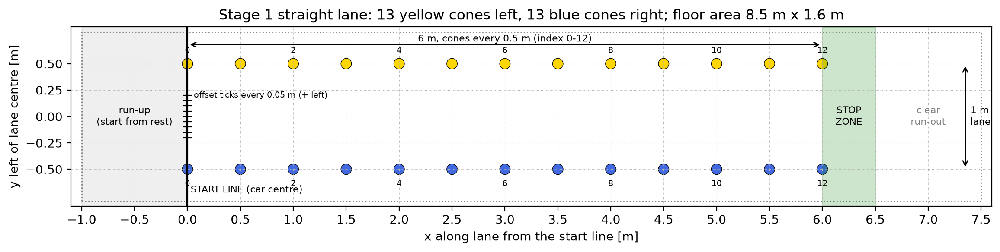
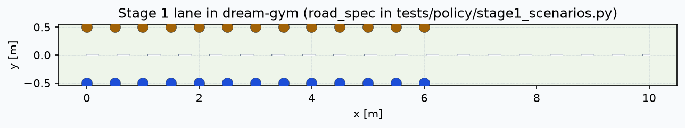

# Stage 1 test cases: straight lane with even cones

Output of **Card 2** in [movement-policy-tasks.md](movement-policy-tasks.md) (tasks 2.1 to 2.5).
The cases run in simulation from `tests/policy/`, and the same lane, cones and starts are used on the floor.

| What | Where |
| --- | --- |
| Lane, disturbances, metrics, pass rule and simulation runner | `tests/policy/stage1_scenarios.py` |
| Tuning cases (use these for design) | `tests/policy/stage1_tuning_cases.py` |
| Unseen cases (final comparison only) | `tests/policy/unseen/stage1_unseen_cases.py` |
| pytest checks of the harness and the MPC on every tuning case | `tests/policy/test_stage1_scenarios.py` |
| Printable floor drawing, simulated lane, trajectory figures | `docs/figures/` |
| Test record sheet template | [stage1-test-record-sheet.csv](stage1-test-record-sheet.csv) |

```bash
pip install -r requirements.txt && pip install wheels/*.whl
python3 -m pytest tests/policy/                           # CI: harness checks and tuning cases
python3 tests/policy/stage1_scenarios.py --figures out/   # metrics table and trajectories for the log-book
python3 tests/policy/stage1_scenarios.py --layout docs/figures   # redraw the floor drawing
```

To test another design (such as RL), pass any object with `run_policy(observations, lanes)` returning a
`DriveCommand` to `run_case`. Both designs then use the same cases, metrics and disturbances (Card 1.3).

## 2.1 Test case table

Signs: left of the lane centre and pointing left are positive. Every case uses the 6 m straight lane below,
and the car starts with its centre on the start line, already at the case speed (a rolling start).

| Case | Set | Start | Speed | Disturbance |
| --- | --- | --- | --- | --- |
| T1 | Tuning | Centred, straight | 1.0 m/s | None |
| T2 | Tuning | 0.15 m to the left | 1.0 m/s | None |
| T3 | Tuning | 10 degrees off to the left | 1.0 m/s | None |
| T4 | Tuning | Centred, straight | 1.0 m/s | Detector noise 0.03 m and one missed cone (yellow 6) |
| T5 | Tuning | 0.15 m right, 10 degrees off to the right | 1.0 m/s | None |
| T6 | Tuning | Centred, straight | 1.0 m/s | 0.2 s detection delay |
| U1-U3 | Unseen | Kept in `tests/policy/unseen/` | | |

T5 checks that turning right works as well as turning left. T6 isolates delay, so delay compensation can be
tuned without noise. The **unseen cases** combine starts, speeds and disturbances not used for tuning. Do not
open or run them while tuning MPC or RL; pytest skips them unless run with `--run-unseen`, which is only for
milestone M1.

### Pass thresholds

**Provisional** until the Card 1.1 requirement and metric table is agreed; `Thresholds` in
`stage1_scenarios.py` holds the values, and both must be kept the same. A case passes only if every row holds.
Metrics are scored from the simulator's true trajectory; the policy never sees it.

| Requirement | Metric | Pass if |
| --- | --- | --- |
| R1 Stay in lane | How far any body corner goes past a cone row while beside the cones | 0.0 m |
| R1 Stay in lane | Distance from the lane centre at the last cone pair, or where the car stopped before it | at most 0.10 m |
| R2 No cone touched | Cones within 0.05 m (a cone base radius) of the car body | 0 |
| R3 Hold speed | Mean absolute speed error from 1 m to 5 m along the lane | at most 0.10 m/s |
| R4 Smooth | RMS rate of change of the requested curvature | at most 1.0 1/(m s) |
| R5 Stop at lane end | Car centre's stop position past the last cone pair | 0.0 to 0.5 m |
| R6 Real time | Solver fallback count | 0 |
| R6 Real time | 99th-percentile calculation time per policy step | at most 50 ms (only meaningful on the car computer) |

The curvature-rate limit is about a fifth of the simulated steering servo's rate limit (90 degrees per second
at the 0.33 m wheelbase). The stop zone follows the card's example rule.

### Current result: shipped MPC on the tuning cases

Shipped `MpcConfig` defaults with the case's speed, in simulation (5 October 2026):

| Case | Touched | Outside lane [m] | Lat. err. at end [m] | Speed err. [m/s] | Curv. rate RMS [1/(m s)] | Stop past last cone [m] | Fallbacks | Result |
| --- | --- | --- | --- | --- | --- | --- | --- | --- |
| T1 | 0 | 0.000 | 0.002 | 0.000 | 0.14 | -0.50 | 0 | Fail (R5) |
| T2 | 0 | 0.000 | 0.003 | 0.000 | 0.35 | -0.51 | 0 | Fail (R5) |
| T3 | 0 | 0.000 | 0.001 | 0.000 | 0.32 | -0.50 | 0 | Fail (R5) |
| T4 | 0 | 0.000 | 0.002 | 0.000 | 0.35 | -0.50 | 0 | Fail (R5) |
| T5 | 0 | 0.000 | 0.000 | 0.000 | 0.62 | -0.51 | 0 | Fail (R5) |
| T6 | 0 | 0.000 | 0.005 | 0.003 | 0.12 | -0.38 | 0 | Fail (R5) |

The MPC follows the lane well on every case, but stops about 0.5 m **before** the last cone pair. Each row
needs two cones at least 0.25 m apart, and the camera cannot see cones less than about 0.6 m ahead at the
side of the lane (80 degree view), so the lane is "lost" before the end. This is the lane-end rule for Task
A7. The stop-zone test is marked `xfail` until then; remove the mark when A7 is done.

## 2.2 Physical cone layout



Printable to scale: [figures/stage1_layout.pdf](figures/stage1_layout.pdf) (A4 landscape).

- Lane: 6.0 m long and 1.0 m wide, with cones every 0.5 m: **13 yellow on the left, 13 blue on the right**.
  Cone index 0 is the pair on the start line and 12 is the last pair; the cases name cones this way.
- Start line through cone pair 0. Mark offset ticks every 0.05 m from 0.2 m right to 0.2 m left of the
  centre, and set the starting heading with a protractor or a taped angle line.
- Run-up: 1.0 m behind the start line, so the real car starts from rest and reaches speed by the start line.
- Stop zone: 0 to 0.5 m past the last cone pair (tape a box). Keep at least another 1.0 m clear after it.
- Floor area: 8.5 m by 1.6 m. Bring 2 spare cones of each colour (fallen or swapped cones in Card 2.4).

## 2.3 The same lane in simulation



`road_spec()` in `stage1_scenarios.py` builds the lane, following the dream-gym cone road examples: one 6 m
straight element with a yellow row at +0.5 m and a blue row at -0.5 m, spacing exactly 0.5 m (standard
deviation 0), then 4 m of road without cones for overruns. A pytest check confirms the simulated cones match
the drawing exactly.

| Simulation setting | Value | Source |
| --- | --- | --- |
| Car | Kinematic bicycle, 0.33 m wheelbase, 3 kg, 45 degree steering | dream-gym cone-following example |
| Cone detector | 80 degree view, 4 m range, 0.01 m position noise | Shared defaults |
| Policy rate | 10 Hz (one detection batch per step); simulation step 0.05 s | Placeholder until Task 1.5 |
| Speed and steering conversion | Stand-in for Car Control: wheel angle = atan(wheelbase x curvature), drag feed-forward plus proportional speed control | Replace with Car Control's conversion (Task 1.4) |
| Wheel speed | True forwards speed, no noise | |

## 2.4 Disturbances to test

| Real problem | How to create it on the floor | Simulation setting (`Disturbances`) |
| --- | --- | --- |
| Missed cone | Remove that cone | `missed_cones=((colour, index),)` |
| Fallen cone | Lay the cone on its side in place | `missed_cones` (it is usually not detected) |
| Wrong colour | Swap in a cone of the other colour | `wrong_colour_cones=((colour, index),)` |
| Detector noise | Uneven lighting, cones at the edge of the view | `noise_m` (0.01 m nominal, 0.03 m as a disturbance) |
| Detection delay | Heavy computer load (also present normally) | `delay_s` (multiples of 0.1 s) |
| Glare or a row out of view | Light shining along one row; or remove one row's last few cones | `missed_cones` for that row |
| Extra object | Put an orange cone or a box beside the lane | Not modelled yet (the detector only reports lane cones) |
| Car mass or grip | Add a weight; run on a different floor | Not modelled yet (needs `make_env` car settings per case) |

## 2.5 Test record sheet

[stage1-test-record-sheet.csv](stage1-test-record-sheet.csv) has the columns for the shared spreadsheet:
import it into the team's shared sheet and link that sheet here. Its example row is a **simulation** dry run of
T1; the first real dry run on the floor is still to be done.

## Open items

- Card 1.1: agree the requirements and metrics, then update `Thresholds` and the table above.
- Task 1.4: which colour is on which side (yellow left is assumed here) and Car Control's conversion.
- Task 1.5: the real detection rate and calculation budget (`POLICY_PERIOD_S`, `TIME_BUDGET_S`).
- Task A1: measured camera view, range and noise; the lab cones' base size (`CONE_RADIUS_M`).
- Task A7: lane-end behaviour, so the stop-zone test can pass.
- Check that the 8.5 m by 1.6 m area fits the lab floor, and count the cones available.
